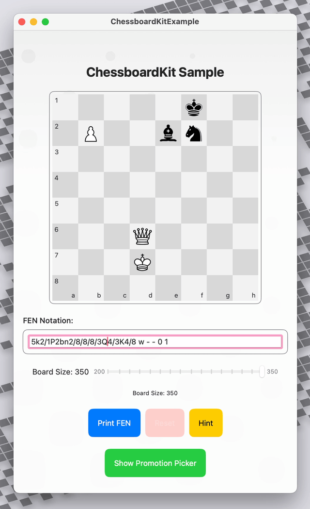
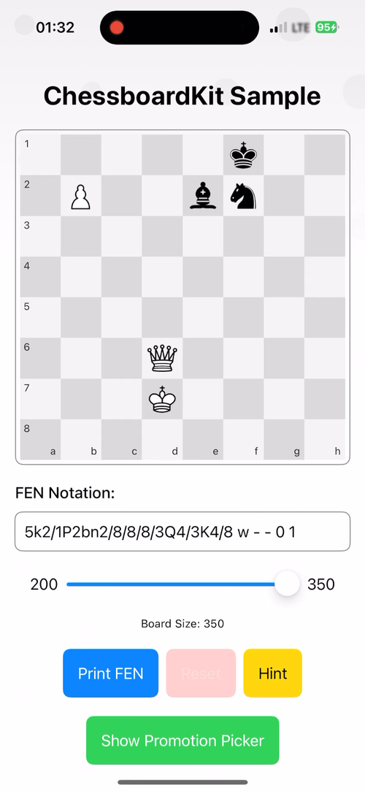
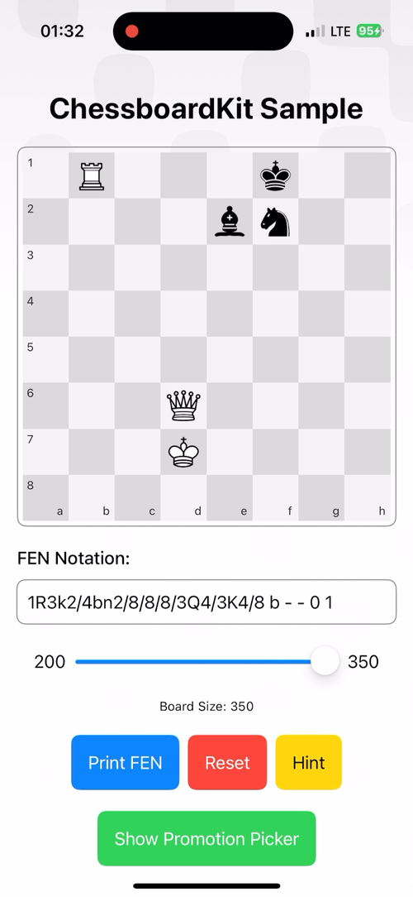

# ChessboardKit

[](https://patreon.com/EvrenselKisilik) [](https://swift.org) [](https://www.apple.com) [](LICENSE)

ChessboardKit is a SwiftUI library for rendering chessboards and playing chess on the board. It provides a highly customizable and interactive chessboard component for your SwiftUI applications.

<div align="center">
  
</div>

## Use for your macOS or iOS/iPadOS app

### Move with drag&drop or click/touch

| iOS                                      | macOS                                    |
|------------------------------------------|------------------------------------------|
|  |  |

### Chess Features

| Promotion Picker                           | Suits its container's size               |
|--------------------------------------------|------------------------------------------|
|  |  |


| Hint                                   | Move Legality Check                    |
|----------------------------------------|----------------------------------------|
|    |    |

### Render the chessboard with only FEN string

ChessboardKit renders the chessboard based on the provided FEN string and updates it when the board position changes.

| FEN Rendering                             |
|-------------------------------------------|
|     |

## Table of Contents

- [ChessboardKit](#chessboardkit)
  - [Use for your macOS or iOS/iPadOS app](#use-for-your-macos-or-iosipados-app)
    - [Move with drag\&drop or click/touch](#move-with-dragdrop-or-clicktouch)
    - [Chess Features](#chess-features)
    - [Render the chessboard with only FEN string](#render-the-chessboard-with-only-fen-string)
  - [Table of Contents](#table-of-contents)
  - [Features](#features)
  - [Supported Platforms](#supported-platforms)
    - [Swift Version](#swift-version)
  - [Installation](#installation)
  - [Quick Start](#quick-start)
  - [Chess Engine](#chess-engine)
  - [Usage](#usage)
    - [Setting Up the Chessboard](#setting-up-the-chessboard)
    - [Handling Moves](#handling-moves)
      - [Making Moves](#making-moves)
    - [Board Size](#board-size)
    - [Customizing the Chessboard](#customizing-the-chessboard)
    - [Advanced Features](#advanced-features)
      - [FEN Rendering](#fen-rendering)
      - [Sliding Animation for Piece Movements](#sliding-animation-for-piece-movements)
      - [Flip The Board for Player Perspective](#flip-the-board-for-player-perspective)
      - [Highlighting Squares](#highlighting-squares)
      - [Waiting State and Avoiding User Interaction](#waiting-state-and-avoiding-user-interaction)
      - [Pawn Promotion](#pawn-promotion)
      - [Fen Validation](#fen-validation)
      - [Move Legality Check](#move-legality-check)
  - [ChessboardModel](#chessboardmodel)
    - [Properties](#properties)
    - [Methods](#methods)
      - [Board Position Management](#board-position-management)
      - [Square Selection](#square-selection)
      - [Square Highlighting](#square-highlighting)
      - [Promotion Management](#promotion-management)
      - [Interaction State](#interaction-state)
    - [Initialization](#initialization)
  - [Color Schemes](#color-schemes)
    - [Custom Color Scheme Example](#custom-color-scheme-example)
  - [Advanced Example Usage](#advanced-example-usage)
  - [❤️ Donations ❤️](#️-donations-️)
    - [Cryptocurrency Donations](#cryptocurrency-donations)
  - [❤️ Buy MacsyZones to support me ❤️](#️-buy-macsyzones-to-support-me-️)
  - [Contributing](#contributing)
  - [Acknowledgments](#acknowledgments)
  - [License](#license)

## Features

- Render chessboards with customizable sizes and styles
- Support for FEN notation to set up board positions
- Interactive piece movement with legality checks
- Promotion picker for pawn promotions
- Slide animation for piece movements
- Highlighting squares for better user interaction
- Click/touch on source and destination squares
- Drag&drop support for piece movement
- Flip board functionality for player perspective
- Built-in FEN serialization and deserialization
- Fen validation

## Supported Platforms

ChessboardKit is designed to work with the following platforms:

- iOS **17+**
- macOS **14+**

### Swift Version

ChessboardKit is written in **Swift 5 or later**.

## Installation

To use ChessboardKit in your project, add it as a dependency in your `Package.swift`:

```swift
.package(url: "https://github.com/rohanrhu/ChessboardKit.git", from: "1.0.0")
```

Then, import the library in your Swift files:

```swift
import ChessboardKit
```

Also, you might want to use the [ChessKit](https://github.com/aperechnev/ChessKit) library:

```swift
import ChessKit
```

> [!NOTE]
> `ChessKit` will be automatically included when you add `ChessboardKit` to your project.

## Quick Start

Here is a simple example to get started with ChessboardKit:

```swift
import SwiftUI
import ChessboardKit

struct ContentView: View {
    @State var chessboardModel = ChessboardModel(fen: "rnbqkbnr/pppppppp/8/8/8/8/PPPPPPPP/RNBQKBNR w KQkq - 0 1")

    var body: some View {
        Chessboard(chessboardModel: chessboardModel)
            .onMove { move, isLegal, from, to, lan, promotionPiece in
                print("Move: \(lan)")
            }
            .frame(width: 300, height: 300)
    }
}
```

## Chess Engine

ChessboardKit uses @aperechnev's amazing [ChessKit](https://github.com/aperechnev/ChessKit) chess engine. The `ChessboardKit` Swift package has it as dependency; when you add `ChessboardKit` to your project, it will automatically add `ChessKit` package to your project.

## Usage

### Setting Up the Chessboard

To set up a chessboard, initialize a `ChessboardModel` with a FEN string and pass it to the `Chessboard` view:

```swift
@State var chessboardModel = ChessboardModel(fen: "rnbqkbnr/pppppppp/8/8/8/8/PPPPPPPP/RNBQKBNR w KQkq - 0 1")
```

```swift
Chessboard(chessboardModel: chessboardModel)
```

### Handling Moves

You can handle moves using the `onMove` callback:

> [!NOTE]
> The `promotionPiece` parameter will be `nil` if the move is not a promotion.

```swift
Chessboard(chessboardModel: chessboardModel)
    .onMove { move, isLegal, from, to, lan, promotionPiece in
        print("Move: \(lan)")
    }
```

> [!IMPORTANT]
> ChessboardKit doesn't perform the move on chess engine automatically. You need to handle the move logic in your app, such as updating the chess engine state and the chessboard model. **Follow the example below to see how to handle moves.**

#### Making Moves

When your `onMove` callback is called, you need to perform the move with the chess engine and update the chessboard model with the new FEN string:

```swift
.onMove { move, isLegal, from, to, lan, promotionPiece in
    print("Move: Fen: \(chessboardModel.fen) - Lan: \(lan)")
    
    if !isLegal {
        print("Illegal move: \(lan)")
        return
    }
    
    chessboardModel.game.make(move: move)
    chessboardModel.setFen(FenSerialization.default.serialize(position: chessboardModel.game.position), lan: lan)
}
```

> [!NOTE]
> You can see what `chessboardModel.game` has for doing more.

### Board Size

You can customize the board size and appearance:

```swift
Chessboard(chessboardModel: chessboardModel)
    .frame(width: 400, height: 400)
```

### Customizing the Chessboard

The `Chessboard` view automatically adjusts its size based on the provided frame.

### Advanced Features

#### FEN Rendering

ChessboardKit renders the chessboard based on the provided FEN string. You can set or get the FEN string using the `ChessboardModel.setFen(_ fen: String, lan: String? = nil)` method.

```swift
chessboardModel.setFen("New FEN string")
```

or directly set the FEN string:

```swift
chessboardModel.fen = "New FEN string"
```

You can also get the current FEN string:

```swift
let currentFen = chessboardModel.fen
```

#### Sliding Animation for Piece Movements

When you use the `setFen` method by providing `lan` parameter too within SwiftUI's `withAnimation`, you can animate the chess movements.

```swift
withAnimation {
    chessboardModel.setFen("New FEN string", lan: "Move LAN string")
}
```

You can also use any animation with the `withAnimation` block.

```swift
withAnimation(.bouncy(duration: 1.)) {
    chessboardModel.setFen("New FEN string", lan: "Move LAN string")
}
```

#### Flip The Board for Player Perspective

You can pass the `perspective` parameter to your `ChessboardModel` to flip the board for the player's perspective:

```swift
@State var chessboardModel = ChessboardModel(fen: "rnbqkbnr/pppppppp/8/8/8/8/PPPPPPPP/RNBQKBNR w KQkq - 0 1", perspective: .white)
```

#### Highlighting Squares

You can highlight specific squares on the board for better user interaction:

```swift
chessboardModel.hint(row: 3, column: 4)
```

To clear all highlighted squares:

```swift
chessboardModel.clearHint()
```

#### Waiting State and Avoiding User Interaction

Indicate a waiting state on the board:

```swift
chessboardModel.beginWaiting()
```

To end the waiting state:

```swift
chessboardModel.endWaiting()
```

#### Pawn Promotion

When it is time for a pawn promotion, the `Chessboard` view will automatically show a promotion picker and handle the promotion process. When a promotion is made, the `onMove` callback will receive the promotion piece as a parameter.

#### Fen Validation

ChessboardKit has a `FenValidation` class that has a static method `validateFen(_ fen: String) -> Bool` to validate FEN strings. You can use this method to check if a FEN string is valid before using it in your chessboard.

```swift
let isValid = FenValidation.validateFen("rnbqkbnr/pppppppp/8/8/8/8/PPPPPPPP/RNBQKBNR w KQkq - 0 1")
```

#### Move Legality Check

If you want `Chessboard` view to check the legality of moves, you can enable it with the `validateMoves` state of `ChessboardModel`.

```swift
@State var chessboardModel = ChessboardModel(validateMoves: true)
```

## ChessboardModel

`ChessboardModel` is the core data model that manages the state of the chessboard. It provides properties and methods to interact with the chessboard programmatically.

### Properties

- `fen`: `String` - The current FEN string representation of the board position
- `size`: `CGFloat` - The size of the chessboard in points
- `colorScheme`: `ChessboardColorScheme` - The color scheme used for the board
- `perspective`: `PieceColor` - The side of the board (white or black) that appears at the bottom
- `turn`: `PieceColor` - The current player's turn (white or black)
- `validateMoves`: `Bool` - Whether to validate moves according to chess rules
- `allowOpponentMove`: `Bool` - Whether to allow moves for the opponent
- `inWaiting`: `Bool` - Indicates if the board is in a waiting state
- `selectedSquare`: `BoardSquare?` - The currently selected square on the board
- `hintedSquares`: `Set<BoardSquare>` - A set of squares that are highlighted
- `showPromotionPicker`: `Bool` - Whether the promotion picker is currently displayed
- `game`: `Game` - The underlying chess game object
- `currentMove`: `Move?` and `prevMove: Move?` - Current and previous move objects
- `promotionPiece`: `Piece?` - The piece being promoted when a promotion is in progress
- `shouldFlipBoard`: `Bool` - Whether the board should be flipped based on perspective
- `movingPiece`: `(piece: Piece, from: BoardSquare, to: BoardSquare)?` - Piece currently being animated
- `onMove`: `(Move, Bool, String, String, String, PieceKind?) -> Void` - Callback for moves

### Methods

`ChessboardModel` provides various methods to manipulate and interact with the chessboard.

#### Board Position Management

Methods to set and manage the board position:

```swift
// Set a new FEN position with optional animation of opponent's move
func setFen(_ fen: String, lan: String? = nil)
```

#### Square Selection

Methods to manage the selected squares:

```swift
// Deselect the currently selected square
func deselect()
```

#### Square Highlighting

Methods to highlight squares for visual feedback:

```swift
// Highlight squares using various methods
func hint(_ square: BoardSquare)
func hint(_ square: String)
func hint(row: Int, column: Int)
func hint(_ squares: [BoardSquare])
func hint(_ squares: [String])

// Clear all highlighted squares
func clearHint()

// Highlight squares for a specific duration
func hint(_ square: String, for seconds: Double)
func hint(_ squares: [String], for seconds: Double)
func hint(_ squares: [BoardSquare], for seconds: Double)
func hint(_ square: BoardSquare, for seconds: Double)
```

#### Promotion Management

Methods to handle pawn promotion:

```swift
// Manage the promotion picker
func presentPromotionPicker(piece: Piece, sourceSquare: String, targetSquare: String, lan: String)
func absentePromotionPicker() 
func togglePromotionPicker()

// Check if a move is a pawn promotion
func isPromotable(piece: Piece, lan: String) -> Bool
```

#### Interaction State

Methods to control the board's interaction state:

```swift
// Control waiting state
func beginWaiting()
func endWaiting()
```

### Initialization

You can initialize a `ChessboardModel` with custom options:

```swift
ChessboardModel(
    fen: "rnbqkbnr/pppppppp/8/8/8/8/PPPPPPPP/RNBQKBNR w KQkq - 0 1", // FEN string
    perspective: .white,                                             // Board perspective
    colorScheme: .light,                                             // Color scheme
    allowOpponentMove: false                                         // Allow opponent moves
)
```

## Color Schemes

ChessboardKit provides some default color schemes. Just pass the `colorScheme` parameter like `ChessboardModel(colorScheme: .blue)`.

You can also make your own color schemes with the `ChessboardColorScheme` protocol. Here are some examples of default color schemes:

```swift
public protocol ChessboardColorScheme: Sendable {
    var light: Color { get }
    var dark: Color { get }
    var label: Color { get }
    var selected: Color { get }
    var hinted: Color { get }
}
```

### Custom Color Scheme Example

```swift
public struct CustomColorScheme: ChessboardColorScheme {
    public var light: Color = Color.white
    public var dark: Color = Color.black
    public var label: Color = Color.gray
    public var selected: Color = Color.blue
    public var hinted: Color = Color.red
}
```

Then, use it like this:

```swift
@State var chessboardModel = ChessboardModel(colorScheme: CustomColorScheme())
```

## Advanced Example Usage

<details>
<summary>Click to expand the full advanced example code</summary>

```swift
import SwiftUI

import ChessboardKit
import ChessKit

struct ContentView: View {
    var body: some View {
        VStack {
            TestBoard()
        }
        .ignoresSafeArea()
        .preferredColorScheme(.light)
    }
}

public struct TestBoard: View {
    static let POSITION = "5k2/1P2bn2/8/8/8/3Q4/3K4/8 w - - 0 1"
    
    @State var showError: Bool = false
    @State var errorMessage: String = ""
    
    @State var size: CGFloat = 350
    
    @Bindable var chessboardModel = ChessboardModel(fen: POSITION,
                                                    perspective: .white,
                                                    colorScheme: .light)
    
    @State var fen = POSITION
    
    var backgroundAnimationStartDate = Date()
    
    public var body: some View {
        VStack(spacing: 20) {
            VStack {}.frame(height: 50)
            
            Text("ChessboardKit Sample")
                .font(.title)
                .fontWeight(.bold)
            
            Chessboard(chessboardModel: chessboardModel)
                .onMove { move, isLegal, from, to, lan, promotionPiece in
                    print("Move: Fen: \(chessboardModel.fen) - Lan: \(lan)")
                    
                    if !isLegal {
                        print("Illegal move: \(lan)")
                        return
                    }
                    
                    chessboardModel.game.make(move: move)
                    chessboardModel.setFen(FenSerialization.default.serialize(position: chessboardModel.game.position), lan: lan)
                }
                .frame(width: size, height: size)
                .padding(5)
                .overlay(RoundedRectangle(cornerRadius: 8).stroke(Color.gray, lineWidth: 1))
            
            VStack(alignment: .leading) {
                Text("FEN Notation:")
                    .fontWeight(.medium)
                
                TextField("Enter FEN", text: $fen)
                    .padding(10)
                    .background(
                        RoundedRectangle(cornerRadius: 8)
                            .stroke(Color.gray, lineWidth: 1)
                    )
                    .onChange(of: fen) { _, newValue in
                        if !FenValidation.validateFen(newValue) {
                            showError = true
                            errorMessage = "Invalid FEN notation."
                            return
                        } else {
                            showError = false
                            errorMessage = ""
                        }
                        
                        chessboardModel.setFen(newValue)
                    }
                    .onChange(of: chessboardModel.fen) {
                        fen = chessboardModel.fen
                    }
                
                if showError {
                    Text(errorMessage)
                        .foregroundColor(.red)
                        .font(.caption)
                }
            }
            
            Slider(value: $size, in: 200...350, step: 10) {
                Text("Board Size: \(Int(chessboardModel.size))")
            } minimumValueLabel: {
                Text("200")
            } maximumValueLabel: {
                Text("350")
            }
            .padding(.horizontal)
            
            Text("Board Size: \(Int(size))")
                .font(.caption)
            
            HStack {
                Button {
                    print(FenSerialization.default.serialize(position: chessboardModel.game.position))
                } label: {
                    Text("Print FEN")
                        .padding()
                        .background(Color.blue)
                        .foregroundColor(.white)
                        .cornerRadius(8)
                }
                .buttonStyle(.plain)
                
                Button {
                    withAnimation {
                        chessboardModel.fen = Self.POSITION
                    }
                } label: {
                    Text("Reset")
                        .padding()
                        .background(Color.red)
                        .foregroundColor(.white)
                        .cornerRadius(8)
                        .modifier {
                            if chessboardModel.fen == Self.POSITION {
                                $0.opacity(0.5)
                            } else { $0 }
                        }
                }
                .disabled(chessboardModel.fen == Self.POSITION)
                
                Button {
                    chessboardModel.hint("d3", for: 1)
                } label: {
                    Text("Hint")
                        .padding()
                        .background(Color.yellow)
                        .foregroundColor(.black)
                        .cornerRadius(8)
                }
                .buttonStyle(.plain)
            }
            .buttonStyle(.plain)
            
            Button {
                chessboardModel.togglePromotionPicker()
            } label: {
                VStack {
                    if chessboardModel.showPromotionPicker {
                        Text("Hide Promotion Picker")
                    } else {
                        Text("Show Promotion Picker")
                    }
                }
                .padding()
                .background(chessboardModel.showPromotionPicker ? Color.red : Color.green)
                .foregroundColor(.white)
                .cornerRadius(8)
            }
            .buttonStyle(.plain)
            
            Spacer()
        }
        .padding()
        .background {
            GeometryReader { proxy in
                ZStack {
                    TimelineView(.animation) { context in
                        Color.white
                            .scaledToFill()
                            .visualEffect { content, proxy in
                                content
                                    .colorEffect(ShaderLibrary.circlesBackground(
                                        .boundingRect,
                                        .float(backgroundAnimationStartDate.timeIntervalSinceNow),
                                        .color(Color(hue: 0.0, saturation: 0.0, brightness: 0.935)),
                                        .color(Color(hue: 0.0, saturation: 0.0, brightness: 0.890))
                                    ))
                            }
                    }
                    
                    LinearGradient(
                        stops: [
                            .init(color: .white.opacity(0.1), location: 0),
                            .init(color: .white.opacity(0.9), location: 0.33)
                        ],
                        startPoint: .top,
                        endPoint: .bottom
                    )
                }
                .frame(width: proxy.size.width, height: proxy.size.height)
                .clipped()
            }
        }
    }
}

#Preview {
    ContentView()
}
```
</details>

This example shows a complete implementation of a ChessboardKit sample with FEN validation, board size adjustment, hints, and a promotion picker.

## ❤️ Donations ❤️

You love [ChessboardKit](https://github.com/rohanrhu/ChessboardKit)? You can support the development by making a donation. You have the following options to donate:

- [Patreon](https://www.patreon.com/evrenselkisilik)
- [GitHub Sponsors](https://github.com/sponsors/rohanrhu)

### Cryptocurrency Donations

| Currency          | Address                                                                                         |
| ----------------- | ----------------------------------------------------------------------------------------------- |
| BTC               | bc1qhvlc762kwuzeawedl9a8z0duhs8449nwwc35e2                                                      |
| ETH / USDT / USDC | 0x1D99B2a2D85C34d478dD8519792e82B18f861974                                                      |
| XMR               | 88qvS4sfUnLZ7nehFrz3PG1pWovvEgprcUhkmVLaiL8PVAFgfHjspjKPLhWLj3DUcm92rwNQENbJ1ZbvESdukWvh3epBUty |

Preferably, donating USDT or USDC is recommended but you can donate any of the above currencies. 🥳

## ❤️ Buy MacsyZones to support me ❤️

You can buy my [MacsyZones](https://macsyzones.com) app to support me. MacsyZones is a revolutionary window manager for macOS.

## Contributing

We welcome contributions to ChessboardKit. Please see the [CONTRIBUTING.md](CONTRIBUTING.md) file for more information.

## Acknowledgments

Special thanks to @aperechnev of amazing [ChessKit](https://github.com/aperechnev/ChessKit) chess engine library for providing the chess engine used in this library.

## License

Copyright (C) 2025, Oğuzhan Eroğlu <rohanrhu2@gmail.com> (<https://meowingcat.io/>)

ChessboardKit is licensed under the MIT License. See the [LICENSE](LICENSE) file for more information.
